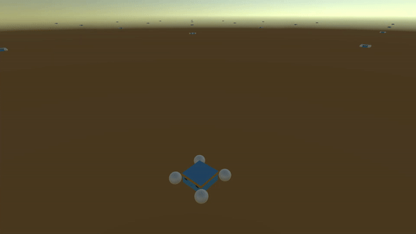
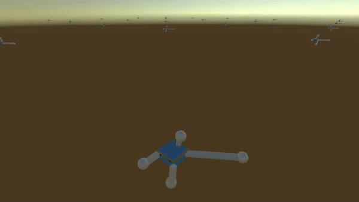
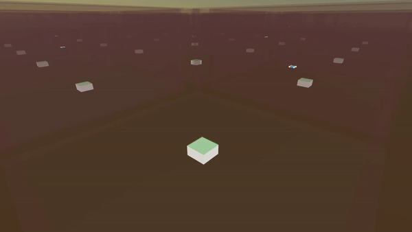

NOTE: due to size of project, code is not included.

# Drone-autonomy-using-ML-Agents
Using Unity's ML Agents to teach a virtual drone to fly and do tasks using reinforcement learning.

# Examples
## Basic quad copter learning to hover example

## Irregular quad copter learning to hover example (with external nudging forces test)

## Drone attempting to land on a platform

